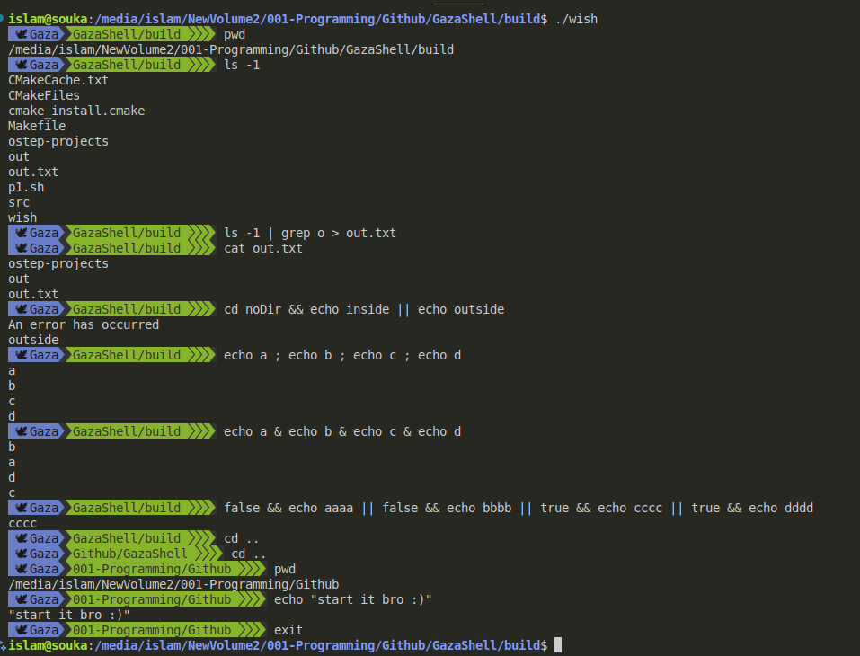

# GazaShell

GazaShell is a custom shell implementation written in C and C++. It provides a command-line interface for executing commands with support for input/output redirection, pipelines, and conditional execution.

## Features

- **Command Processing**: Tokenizes and parses user input into executable commands
- **Pipelines**: Connect multiple commands with pipes (`|`)
- **Conditional Execution**: Support for `&&` and `||` operators
- **Sequential Execution**: Execute commands in sequence with `;`
- **Parallel Commands**: Run commands in Parallel using `&`
- **I/O Redirection**: Handle input (`<`), output (`>`), and error (`2>`) redirection
- **Built-in Commands**: Includes essential commands like `cd`, `pwd`, `path`, and `exit`

## Example Commands



## Project Structure

```
.
├── src/
│   ├── builtin.c        # Built-in command implementations
│   ├── command.c        # Command execution logic
│   ├── conditional_cmd.c # Conditional command handling
│   ├── list.c           # List data structure implementation
│   ├── parser.c         # Command parsing module
│   ├── path.c           # Path management
│   ├── pipe.c           # Pipeline implementation
│   ├── scanner.c        # Input tokenization
│   ├── include/         # Header files
│       ├── builtin.h
│       ├── command.h
│       ├── conditional_cmd.h
│       ├── list.h
│       ├── parser.h
│       ├── path.h
│       ├── pipe.h
│       ├── scanner.h
├── v0/
│   ├── GazaShell.cpp    # Initial implementation
├── main.c               # Main entry point
├── README.md
```

## Architecture

### Scanner
Tokenizes user input by breaking it down into individual tokens using delimiters like spaces and tabs.

### Parser
Processes tokens into structured commands, handling operators for redirection, pipelines, and conditional execution.

### Execution Engine
Manages command execution through system calls, implements I/O redirection, and handles exit statuses.

### Built-in Commands
Native shell functions that don't spawn new processes, including:
- `cd`: Change directory
- `pwd`: Print working directory
- `path`: Manage command search paths
- `exit`: Terminate the shell

## Building and Running

1. **Build the project**:
   ```bash
   mkdir build
   cd build
   cmake ..
   make
   ```

2. **Run GazaShell**:
   ```bash
   ./wish
   ```

## Usage Examples

### Basic Commands
```bash
wish> ls -l
wish> pwd
```

### Pipelines
```bash
wish> ls -l | grep ".c" | wc -l
```

### I/O Redirection
```bash
wish> ls > files.txt
wish> cat < input.txt
wish> find / -name "*.c" 2> errors.log
```

### Conditional Execution
```bash
wish> mkdir test && cd test || echo "Failed to create directory"
```

### Parallel Commands
```bash
wish> echo a & echo b & echo c & echo d
```


### Sequential Execution
```bash
wish> echo "First command"; echo "Second command"
```

### Built-in Commands
```bash
wish> cd /path/to/directory
wish> pwd
wish> exit
```

### Path Management
```bash
wish> path /bin /usr/bin /usr/local/bin
```

## Contributing

Contributions are welcome! Feel free to submit issues or pull requests for bug fixes, enhancements, or new features.
